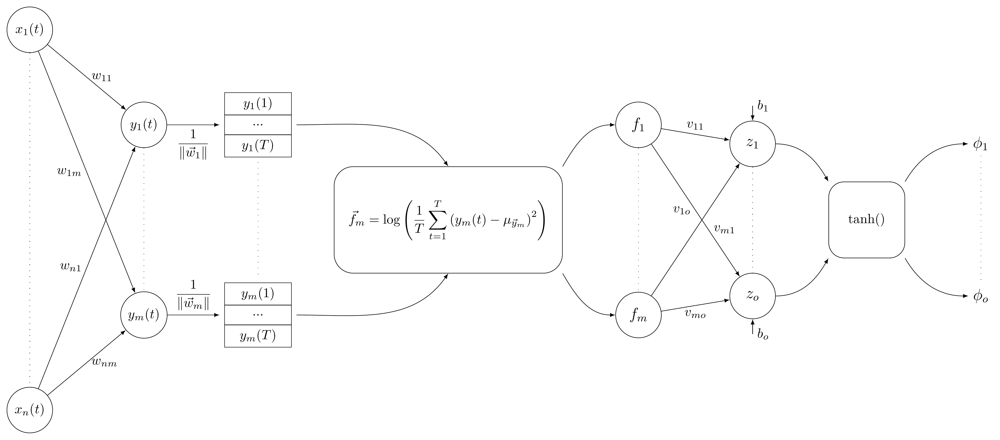

# SFN

论文地址:https://pubmed.ncbi.nlm.nih.gov/25933101/

手头只有BCI Competition IV dataset 2a的数据集，所以就用这个数据集测试了。结果感人。

# 第1个人的分类正确率为：0.44

# 第2个人的分类正确率为：0.66

# 第3个人的分类正确率为：0.66

# 第4个人的分类正确率为：0.32

# 第5个人的分类正确率为：0.38

# 第6个人的分类正确率为：0.4

# 第7个人的分类正确率为：0.62

# 第8个人的分类正确率为：0.92

# 第9个人的分类正确率为：0.6

# 第1个人的分类正确率为：0.46

# 第1个人的分类正确率为：0.32

# 第1个人的分类正确率为：0.32

# 第1个人的分类正确率为：0.32

# 第1个人的分类正确率为：0.32

# 第1个人的分类正确率为：0.32

# 第1个人的分类正确率为：0.32

# 第1个人的分类正确率为：0.32

# 第1个人的分类正确率为：0.32

# 第1个人的分类正确率为：0.32

# 第1个人的分类正确率为：0.32

# 第1个人的分类正确率为：0.32

# 第1个人的分类正确率为：0.32

# 第1个人的分类正确率为：0.32

# 第1个人的分类正确率为：0.32

# 第1个人的分类正确率为：0.24

# 第1个人的分类正确率为：0.24

# 第1个人的分类正确率为：0.24

# 第1个人的分类正确率为：0.16

